# Voorbeelden

@@@ todo: de volgende vier voorbeelden opnemen:

- [Parkeervergunning – Inzien ](https://www.samenwerkruimten.nl/teamsites/project verwerkingenlogging/Gedeelde  documenten/Informatieanalyse/Cases/Parkeervergunning_Inzien vergunningen.docx?web=1)[parkeervergunning](https://www.samenwerkruimten.nl/teamsites/project verwerkingenlogging/Gedeelde  documenten/Informatieanalyse/Cases/Parkeervergunning_Inzien vergunningen.docx?web=1)

- [Parkeervergunning – Wijzigen ](https://www.samenwerkruimten.nl/teamsites/project verwerkingenlogging/Gedeelde  documenten/Informatieanalyse/Cases/Parkeervergunning_wijzigen vergunningen.docx?web=1)[parkeervergunning](https://www.samenwerkruimten.nl/teamsites/project verwerkingenlogging/Gedeelde  documenten/Informatieanalyse/Cases/Parkeervergunning_wijzigen vergunningen.docx?web=1)

- [Registratie verhuizing – Eenvoudig, traditioneel system](https://www.samenwerkruimten.nl/teamsites/project verwerkingenlogging/Gedeelde  documenten/Informatieanalyse/Cases/Registratie Verhuizing – Eenvoudig, traditioneel systeem.docx?web=1)

- [Registratie verhuizing – Opvragen meerdere BSN’s](https://www.samenwerkruimten.nl/teamsites/project verwerkingenlogging/Gedeelde  documenten/Informatieanalyse/Cases/Registratie Verhuizing – opvragen meerdere BSN's.docx?d=wfab71607179442769b593757fb04dcb3)

## Parkeervergunning - inzien
### Situatieschets
Een persoon heeft bij een gemeente een parkeervergunning in gebruik en wil de gegevens van deze vergunning bekijken.

### Uitgangspunten
•	Het beschreven proces is een voorbeeld, het werkelijke proces kan anders verlopen.

•	Het proces is een ‘happy flow’ dit betekent dat validaties en eventuele foutsituaties in dit voorbeeld niet in ogenschouw worden genomen.

•	Autorisatieprocessen zijn in dit voorbeeld niet meegenomen.

•	Een Loggingsregel wordt toegevoegd aan het logboek per **geheel** afgeronde transactie. Er wordt dus **geen** aparte logregel aangemaakt per ontvangen of verstuurd bericht.

•	Een aantal gegevens staan nog ter discussie (vanuit juridisch oogpunt). Voor de volledigheid worden een aantal gegevens in dit voorbeeld meegenomen. Het betreft de gegevens:

o	resource/name/version

o	receiver

o	dataSubject

### Globaal proces
1.	Een persoon vraagt in zijn ‘MijnOmgeving’ van de gemeente om de bestaande parkeervergunninggegevens.
   
2.	De ‘MijnOmgeving’ van de gemeente verzoekt de parkeervergunningapplicatie om de actuele parkeervergunninggegevens van de persoon.

3.	Het parkeervergunningsysteem voert dit verzoek uit. Daarna verzendt de parkeervergunningapplicatie de gevraagde gegevens naar de gemeente. Het parkeervergunningensysteem logt dat er gegevens verzonden zijn naar de gemeente.

4.	De gemeente toont de gegevens aan de persoon en logt dat deze gegevens zijn getoond aan de persoon.

Schematisch ziet dit proces er als volgt uit:

### Logging van gegevens
De volgende gegevens worden gelogd in de diverse logmomenten:

**Log opvragenVergunningen (log vergunningenapplicatie):**
| Attribuut   | Waarde   |
|-------------|----------|
|operationId	|8451dcd9ede037cb|
|operationName	|opvragenVergunningen|
|parentOperationId	|`<leeg>`|
|traceId	|ccf5064a324163ed939bfa09c2bcb210|
|startTime	|2024-05-30 08:40:37.000|
|endTime	|2024-05-30 08:40:37.000|
|statusCode	|OK|
|resource.name	|Parkeeradmin|
|resource.version	|2.1.6|
|receiver|	`<leeg>`|
|attributeKey	|dplCoreProcessingActivityId|
|attributeValue	|rva:12f2ec2a-0cc4-3541-9ae6-219a178fcfe4|
|attributeKey	|`<leeg>`|
|attributeValue	|`<leeg>`|
|foreignOperation.traceId	|c7a26dcd0bee0c8900e2174c43c3393c|
|foreignOperation.operationId|	9f8971bfd093637d|

**Log opvragenVergunningen (log gemeente)**
| Attribuut   | Waarde   |
|-------------|----------|
|operationId	|9f8971bfd093637d|
|operationName	|tonenVergunningen|
|parentOperationId|	`<leeg>`|
|traceId	|c7a26dcd0bee0c8900e2174c43c3393c|
|startTime	|2024-05-30 10:40:37.821|
|endTime	|2024-05-30 10:40:37.845|
|statusCode	|OK|
|resource.name	|MijnOmgeving|
|resource.version	|1.0.5|
|receiver	|27fdey98605etc48|
|attributeKey	|dplCoreProcessingActivityId|
|attributeValue	|rva:11x2ec2a-0774-3541-9b16-21ba179fcf15|
|attributeKey	|dplCoreDataSubjectId|
|attributeValue	|rva:13j2ec27-0cc4-3541-9av6-219a178fcfe5|

### Relatie tussen gegevens

Om uiteindelijk alle gegevens te kunnen rapporteren, is het van belang dat gegevens op een bepaalde manier aan elkaar gekoppeld zijn. In dit voorbeeld zijn de gegevens op de volgende manier gekoppeld:
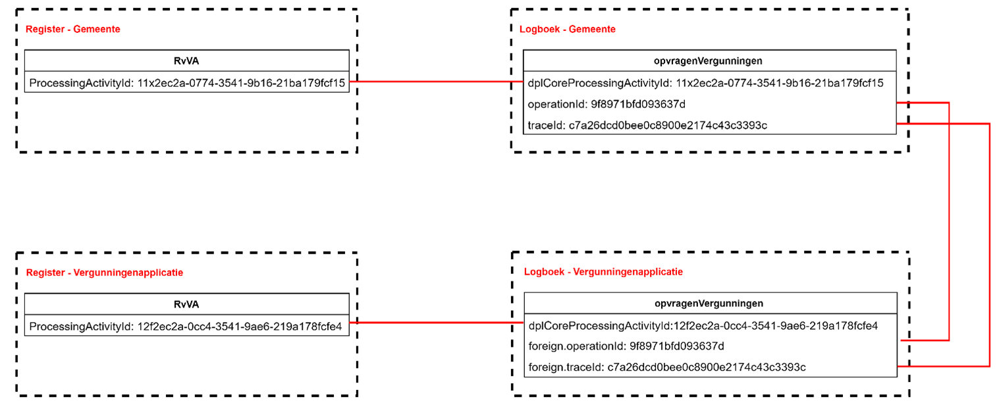

### Relatie met de standaard Logboek dataverwerkingen
De relatie met de doelstellingen die gesteld zijn in de standaard Logboek dataverwerkingen worden, op basis van dit voorbeeld, als volgt concreet gerealiseerd:

**- het wegschrijven van logs van dataverwerkingen:** In dit voorbeeld is het de betrokkene zelf die via een portaal zijn eigen gegevens kan bekijken. Deze actie is een gegevensverwerking en wordt gelogd bij zowel de gemeenteapplicatie (gegevens worden getoond aan de betrokkene) als bij de vergunningenapplicatie (verstrekking specifieke informatie aan de gemeenteapplicatie).

**- het aan elkaar relateren van logs van dataverwerkingen:** Er zijn in dit voorbeeld twee applicaties nodig om het totaal aan gevraagde informatie te kunnen tonen aan de betrokkene. Beide applicaties hebben een logboek voor verwerkte gegevens. Om een totaalbeeld van de gelogde gegevens te kunnen construeren, is een relatie tussen de logs nodig. In dit voorbeeld wordt de koppeling gelegd door het operationId en traceId (gemeentelogboek) te linken aan het foreignOperationId en foreignTraceId (vergunningenlogboek).

**- het aan elkaar relateren van dataverwerkingen over de grenzen van systemen:** Naast het koppelen van logs van diverse applicaties, wordt ook een koppeling gelegd met het Register van verwerkingsactiviteiten. Dit gebeurt per applicatie op basis van het ProcessingActivityId (register) te koppelen aan dplCoreProcessingActivityId (logboek). De diverse registers hebben **geen** directe koppeling met elkaar.

**Standaard Logverwerkingen: paragraaf 3.3.1 Gedrag**

1. *De applicatie MOET een Trace starten voor iedere Dataverwerking waarvan nog geen Trace bekend is.* Bij elke start van een verwerking wordt een traceId aangemaakt. Bijvoorbeeld: in het voorbeeld komt er een bericht binnen bij de ‘MijnOmgeving’ van de gemeente (opvragenVergunningenVraag). Er wordt direct een traceId aangemaakt.

2. *De applicatie MOET voor iedere Dataverwerking een logregel wegschrijven in een Logboek. Log Sampling is niet toegestaan.* Een dataverwerking wordt opgeslagen als deze volledig is afgerond. In het voorbeeld is te zien dat een logregel wordt geschreven op het moment dat de vraag- en het antwoordbericht zijn afgerond.

3. *De applicatie MOET bijhouden of een Dataverwerking geslaagd of mislukt is en dit per Dataverwerking als status meegeven aan het Logboek.* Bij elke logregel in het voorbeeld staat de statusCode vermeld (‘OK’).

4. *Als een Dataverwerking meerdere Betrokkenen heeft dan MOET de applicatie voor iedere betrokkene een aparte logregel wegschrijven. Een logregel kan naar 0 of 1 betrokkenen verwijzen.* In het voorbeeld gaat het om één betrokkene (dplCoreDataSubjectId), er wordt steeds één logregel aangemaakt.

5. *Als een applicatie aangeroepen kan worden vanuit een andere applicatie MOET de applicatie Trace Context metadata accepteren bij een dergelijke aanroepen deze metadata kunnen omzetten naar een foreign_operation bericht.* Bij een externe verwerking (bijvoorbeeld opvragenVergunningen) geeft de ‘MijnOmgeving’ de traceId en OperationId mee aan de Vergunningenapplicatie. De vergunningenapplicatie registreert de traceId en operationId beide als ‘foreignOperation’.

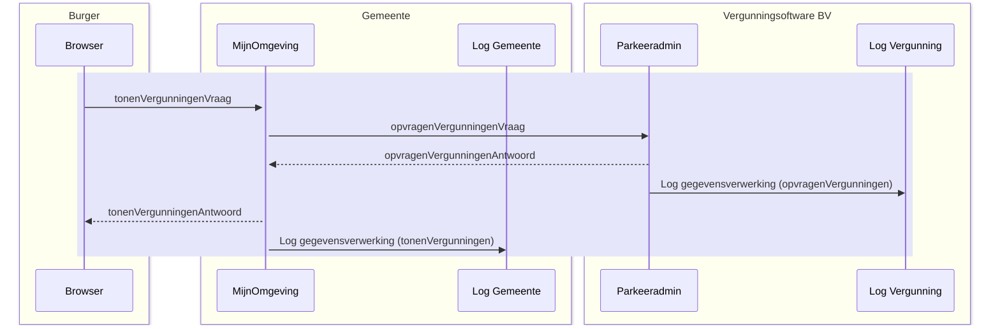

## Parkeervergunning - wijzigen

### Situatieschets
Een persoon heeft bij een gemeente een parkeervergunning in gebruik en wil de gegevens van het kenteken van deze vergunning wijzigen.

### Uitgangspunten
* Het beschreven proces is een voorbeeld, het werkelijke proces kan anders verlopen.

* Het proces is een ‘happy flow’ dit betekent dat validaties en eventuele foutsituaties in dit voorbeeld niet in ogenschouw worden genomen.

* Autorisatieprocessen zijn in dit voorbeeld niet meegenomen.

* Een Loggingsregel wordt toegevoegd aan het logboek per **geheel** afgeronde transactie. Er wordt dus **geen** aparte logregel aangemaakt per ontvangen of verstuurd bericht.

* Een aantal gegevens staan nog ter discussie (vanuit juridisch oogpunt). Voor de volledigheid worden een aantal gegevens in dit voorbeeld meegenomen. Het betreft de gegevens:

    o resource/name/version

    o receiver

    o dataSubject

### Globaal proces
1. Een persoon vraagt in zijn 'MijnOmgeving' van de gemeente om de bestaande parkeervergunninggegevens.
2. De 'MijnOmgeving' van de gemeente verzoekt de parkeervergunningapplicatie om de actuele parkeervergunninggegevens van de persoon.
3. De parkeervergunningapplicatie voert dit verzoek uit. Daarna verzendt de parkeervergunningapplicatie de gevraagde gegevens naar de gemeente. De parkeervergunningapplicatie logt dat er gegevens verzonden zijn naar de gemeente.
4. De gemeente toont de gegevens aan de persoon en logt dat deze gegevens zijn getoond aan de persoon.
5. De persoon wijzigt het kenteken in de 'MijnOmgeving' van de gemeente.
6. De 'MijnOmgeving' van de gemeente verzoekt de parkeervergunningapplicatie om de wijziging af te handelen.
7. De parkeervergunningapplicatie verzoekt het RDW te controleren of het kenteken ook daadwerkelijk bij de persoon hoort.
8. Het RDW stuurt een antwoord terug naar de parkeervergunningapplicatie en logt de gegevensverwerking.
9. De parkeervergunningapplicatie logt het controleverzoek aan het RDW.
10. De parkeervergunningapplicatie wijzigt het kenteken van de persoon en logt het wijzigingsverzoek van de persoon.
11. Nadat de wijziging is gedaan in de parkeervergunningapplicatie, wordt het wijzigingsverzoek gelogd in de 'MijnOmgeving' van de gemeente.
12. De persoon vraagt in zijn 'MijnOmgeving' van de gemeente om de bestaande parkeervergunninggegevens.
13. De 'MijnOmgeving' van de gemeente verzoekt de parkeervergunningapplicatie om de actuele parkeervergunninggegevens van de persoon.
14. De parkeervergunningapplicatie voert dit verzoek uit. Daarna verzendt de parkeervergunningapplicatie de gevraagde gegevens naar de gemeente. De parkeervergunningapplicatie logt dat er gegevens verzonden zijn naar de gemeente.
15. De gemeente toont de gegevens aan de persoon en logt dat deze gegevens zijn getoond aan de persoon.

Schematisch ziet dit proces er als volgt uit:
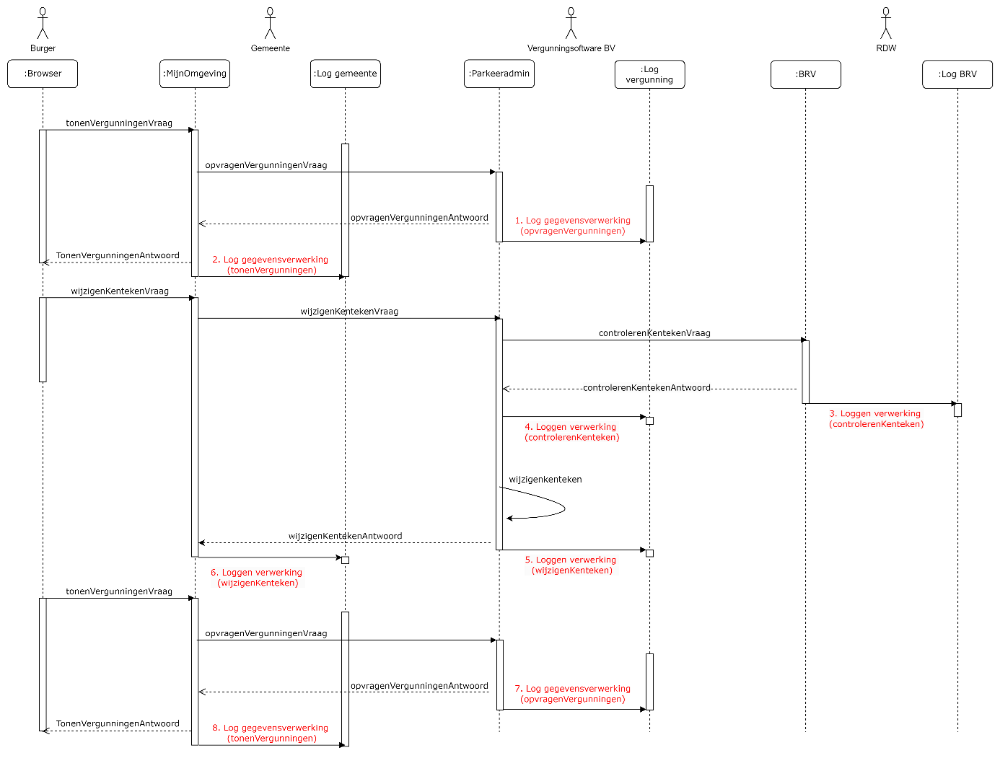

### Logging van gegevens
De volgende gegevens worden gelogd in de diverse logmomenten:

**1.	Log opvragenVergunningen (log vergunningenapplicatie):**

| Attribuut   | Waarde   |
|-------------|----------|
| operationId	| 8ee7b01aca8d01d9 | 
| operationName| 	opvragenVergunningen| 
| parentOperationId	| `<leeg>`| 
| traceId	| c6adf4df949d03c662b53e95debdc411| 
| startTime	| 2024-07-29 08:16:49.000| 
| endTime	| 2024-07-29 08:16:49.000| 
| statusCode	| OK| 
| resource.name	| Parkeeradmin| 
| resource.version	| 2.1.6| 
| receiver	| `<leeg>` | 
| attributeKey	| dplCoreProcessingActivityId| 
| attributeValue	| 12f2ec2a-0cc4-3541-9ae6-219a178fcfe4| 
| attributeKey    | `<leeg>` |
| attributeValue  | `<leeg>` | 
| foreignOperation.traceId	| bc9126aaae813fd491ee10bf870db292| 
| foreignOperation.operationId	| b2e339a595246e01| 

**2.	Log tonenVergunningen (log gemeente)**

| Attribuut   | Waarde   |
|-------------|----------|
| operationId	| b2e339a595246e01| 
| operationName	| tonenVergunningen| 
| parentOperationId	| `<leeg>`| 
| traceId	| bc9126aaae813fd491ee10bf870db292| 
| startTime	| 2024-07-29 10:16:49.690| 
| endTime	| 2024-07-29 10:16:49.723| 
| statusCode	| OK| 
| resource.name	| MijnOmgeving| 
| resource.version	| 1.0.5| 
| receiver	| 27fdey98605etc48| 
| attributeKey	| dplCoreProcessingActivityId| 
| attributeValue	| 11x2ec2a-0774-3541-9b16-21ba179fcf15| 
| attributeKey	| dplCoreDataSubjectId| 
| attributeValue	| 13j2ec27-0cc4-3541-9av6-219a178fcfe5| 

**3. Log controlerenKenteken (log RDW)**

| Attribuut   | Waarde   |
|-------------|----------|
| operationId	|433f276975204ccf|
|operationName	|controlerenKenteken|
|parentOperationIdcontrolerenKenteken|`<leeg>`|
|traceId	|8ccfd3c567c51d68937c263e00a352be|
|startTime	|2024-07-29 08:17:02|
|endTime	|2024-07-29 08:17:02|
|statusCode	|OK|
|resource.name	|BRV|
|resource.version	|2.0|
|receiver	|`<leeg>`|
|attributeKey	|dplCoreProcessingActivityId|
|attributeValue	|8c714e4a-a538-36f7-8b1f-37a6884cc68c|
|attributeKey	|dplCoreDataSubjectId|
|attributeValue	|`<leeg>`|
|foreignOperation.traceId	|f176a58de7fe249ea37ed4f5979da02b|
|foreignOperation.operationId	|414514cf1d40d6b2|

**4.	Log controlerenKenteken (log vergunningenapplicatie)**

| Attribuut   | Waarde   |
|-------------|----------|
| operationId	|414514cf1d40d6b2|
|operationName	|controlerenKenteken|
|parentOperationId	|7a95b6989d2b28c7|
|traceId	|f176a58de7fe249ea37ed4f5979da02b|
|startTime	|2024-07-29 08:17:02.000|
|endTime	|2024-07-29 08:17:02.000|
|statusCode	|OK|
|resource.name	|Parkeeradmin|
|resource.version	|2.1.6|
|receiver	|`<leeg>`|
|attributeKey	|dplCoreProcessingActivityId|
|attributeValue	|19u2dd2a-0cb7-3541-9ae6-217a178fc9e6|
|attributeKey	|dplCoreDataSubjectId|
|attributeValue	|`<leeg>`|
|foreignOperation.traceId	|8a1325a32aef8de4ffba7d7c931eeaec|
|foreignOperation.operationId	|ba7cac7ca0489e42|

**5.	Log wijzigenKenteken (log vergunningenapplicatie)**

| Attribuut   | Waarde   |
|-------------|----------|
| operationId	|7a95b6989d2b28c7|
|operationName	|wijzigenKenteken|
|parentOperationId	|`<leeg>`|
|traceId	|f176a58de7fe249ea37ed4f5979da02b|
|startTime	|2024-07-29 08:17:02.000|
|endTime	|2024-07-29 08:17:02.000|
|statusCode	|OK|
|resource.name	|Parkeeradmin|
|resource.version	|2.1.6|
|receiver	|`<leeg>`|
|attributeKey	|dplCoreProcessingActivityId|
|attributeValue	|0b1ff20a-3ecb-34bf-8cf5-e4cbacb046ab|
|attributeKey	|dplCoreDataSubjectId|
|attributeValue	|`<leeg>`|
|foreignOperation.traceId	|c0a7a38d56f3f16a2163ca0071d3779a|
|foreignOperation.operationId	|df524ee2a3fd5ddf|

**6.	Log wijzigenKenteken (log gemeente)**

| Attribuut   | Waarde   |
|-------------|----------|
| operationId	|df524ee2a3fd5ddf|
|operationName	|wijzigenKenteken|
|parentOperationId	|`<leeg>`|
|traceId	|c0a7a38d56f3f16a2163ca0071d3779a|
|startTime	|2024-07-29 10:17:02.010|
|endTime	|2024-07-29 10:17:02.039|
|statusCode	|OK|
|resource.name	|MijnOmgeving|
|resource.version	|1.0.5|
|receiver	|27fdey98605etc48|
|attributeKey	|dplCoreProcessingActivityId|
|attributeValue	|12c21c2a-0875-3543-9b16-21ja179fcf16|
|attributeKey	|dplCoreDataSubjectId|
|attributeValue	|13j2ec27-0cc4-3541-9av6-219a178fcfe5|
|foreignOperation.traceId	|`<leeg>`|
|foreignOperation.operationId	|`<leeg>`|

**7.	Log opvragenVergunningen (log vergunningenapplicatie)**

| Attribuut   | Waarde   |
|-------------|----------|
| operationId	|6042d706f53fec76|
|operationName	|opvragenVergunningen|
|parentOperationId	|`<leeg>`|
|traceId	|c6c2d53a5762d47779c57057d7983311|
|startTime	|2024-07-29 08:17:02.000|
|endTime	|2024-07-29 08:17:02.000|
|statusCode	|OK|
|resource.name	|Parkeeradmin|
|resource.version	|2.1.6|
|receiver	|`<leeg>`|
|attributeKey	|dplCoreProcessingActivityId|
|attributeValue	|12f2ec2a-0cc4-3541-9ae6-219a178fcfe4|
|attributeKey	|`<leeg>`|
|attributeValue	|`<leeg>`|
|foreignOperation.traceId	|8a1325a32aef8de4ffba7d7c931eeaec|
|foreignOperation.operationId	|ba7cac7ca0489e42|

**8.	Log tonenVergunningen (log gemeente)**

| Attribuut   | Waarde   |
|-------------|----------|
| operationId	|ba7cac7ca0489e42|
|operationName	|tonenVergunningen|
|parentOperationId	|`<leeg>`|
|traceId	|8a1325a32aef8de4ffba7d7c931eeaec|
|startTime	|2024-07-29 10:17:02.274|
|endTime	|2024-07-29 10:17:02.291|
|statusCode	|OK|
|resource.name	|MijnOmgeving|
|resource.version	|1.0.5|
|receiver	|27fdey98605etc48|
|attributeKey	|dplCoreProcessingActivityId|
|attributeValue	|11x2ec2a-0774-3541-9b16-21ba179fcf15|
|attributeKey	|dplCoreDataSubjectId|
|attributeValue	|13j2ec27-0cc4-3541-9av6-219a178fcfe5|

### Relatie tussen gegevens
Om uiteindelijk alle gegevens te kunnen rapporteren, is het van belang dat gegevens op een bepaalde manier aan elkaar gekoppeld zijn. In dit voorbeeld zijn de gegevens op de volgende manier gekoppeld:
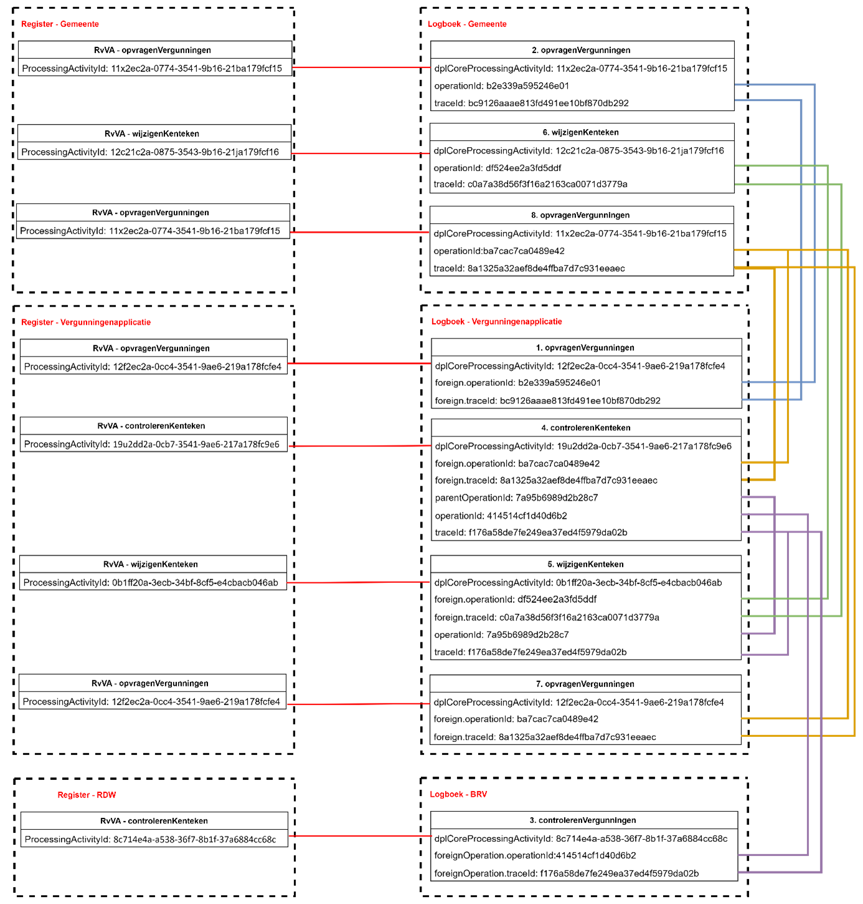

### Relatie met de standaard Logboek Dataverwerkingen
De relatie met de doelstellingen die gesteld zijn in de standaard Logboek dataverwerkingen worden, op basis van dit voorbeeld, als volgt concreet gerealiseerd:

**- het wegschrijven van logs van dataverwerkingen:** In dit voorbeeld is het de betrokkene zelf die via een portaal zijn eigen gegevens kan bekijken en wijzigen. Deze acties zijn gegevensverwerkingen en worden gelogd bij zowel de gemeenteapplicatie (gegevens worden getoond aan de betrokkene) als bij de vergunningenapplicatie (verstrekking specifieke informatie aan de gemeenteapplicatie).

**- het aan elkaar relateren van logs van dataverwerkingen:** Er zijn in dit voorbeeld twee applicaties nodig om het totaal aan gevraagde informatie te kunnen tonen aan de betrokkene. Beide applicaties hebben een logboek voor verwerkte gegevens. Om een totaalbeeld van de gelogde gegevens te kunnen construeren, is een relatie tussen de logs nodig. In dit voorbeeld wordt de koppeling gelegd door het operationId en traceId (gemeentelogboek) te linken aan het foreignOperationId en foreignTraceId (vergunningenlogboek).

**- het aan elkaar relateren van dataverwerkingen over de grenzen van systemen:** Naast het koppelen van logs van diverse applicaties, wordt ook een koppeling gelegd met het Register van verwerkingsactiviteiten. Dit gebeurt per applicatie op basis van het ProcessingActivityId (register) te koppelen aan dplCoreProcessingActivityId (logboek). De diverse registers hebben **geen** directe koppeling met elkaar.

#### Standaard Logverwerkingen: paragraaf 3.3.1 Gedrag

1. *De applicatie MOET een Trace starten voor iedere Dataverwerking waarvan nog geen Trace bekend is.* Bij elke start van een verwerking wordt een traceId aangemaakt. Bijvoorbeeld: in het voorbeeld komt er een bericht binnen bij de ‘MijnOmgeving’ van de gemeente (opvragenVergunningenVraag). Er wordt direct een traceId aangemaakt.

2. *De applicatie MOET voor iedere Dataverwerking een logregel wegschrijven in een Logboek. Log Sampling is niet toegestaan. Een dataverwerking wordt opgeslagen als deze volledig is afgerond.* In het voorbeeld is te zien dat een logregel wordt geschreven op het moment dat de vraag- en het antwoordbericht zijn afgerond.

3. *De applicatie MOET bijhouden of een Dataverwerking geslaagd of mislukt is en dit per Dataverwerking als status meegeven aan het Logboek.* Bij elke logregel in het voorbeeld staat de statusCode vermeld (‘OK’).

4. *Als een Dataverwerking meerdere Betrokkenen heeft dan MOET de applicatie voor iedere betrokkene een aparte logregel wegschrijven. Een logregel kan naar 0 of 1 betrokkenen verwijzen.* In het voorbeeld gaat het om één betrokkene (dplCoreDataSubjectId), er wordt steeds één logregel aangemaakt.

5. *Als een applicatie aangeroepen kan worden vanuit een andere applicatie MOET de applicatie Trace Context metadata accepteren bij een dergelijke aanroepen deze metadata kunnen omzetten naar een foreign_operation bericht.* Bij een externe verwerking (bijvoorbeeld opvragenVergunningen) geeft de ‘MijnOmgeving’ de traceId en OperationId mee aan de Vergunningenapplicatie. De vergunningenapplicatie registreert de traceId en operationId beide als ‘foreignOperation’.

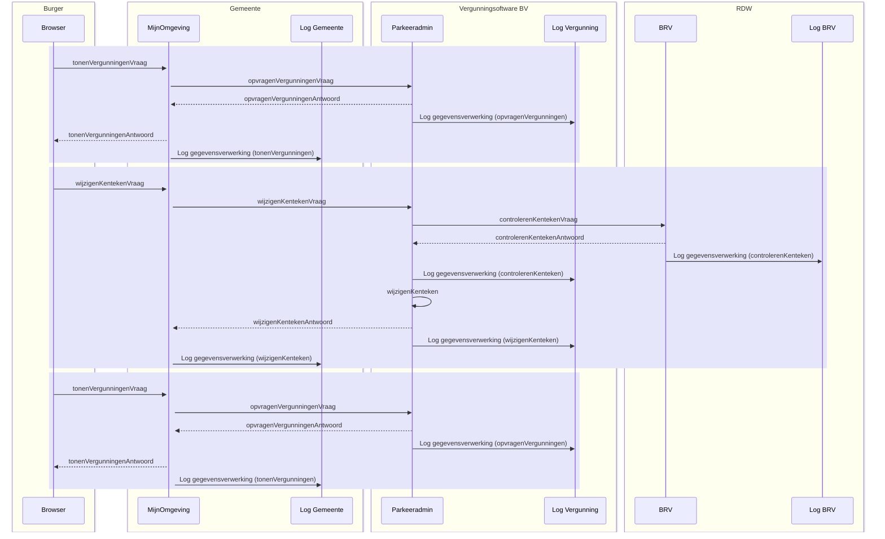

## Registratie Verhuizing - Eenvoudig, traditioneel systeem

### Situatieschets
Deze case beschrijft de binnengemeentelijke verhuizing van een persoon. De beschrijving is functioneel zo eenvoudig mogelijk. De burger komt aan de balie en er is geen sprake van meeverhuizende gezinsleden.

### Uitgangspunten

•	Het beschreven proces is een voorbeeld, het werkelijke proces kan anders verlopen.

•	Het proces is een ‘happy flow’ dit betekent dat validaties en eventuele foutsituaties in dit voorbeeld niet in ogenschouw worden genomen.

•	Autorisatieprocessen zijn in dit voorbeeld niet meegenomen.

•	Een Loggingsregel wordt toegevoegd aan het logboek per **geheel** afgeronde transactie. Er wordt dus **geen** aparte logregel aangemaakt per ontvangen of verstuurd bericht.

•	Een aantal gegevens staan nog ter discussie (vanuit juridisch oogpunt). Voor de volledigheid worden een aantal gegevens in dit voorbeeld meegenomen. Het betreft de gegevens:

  o	resource/name/version
  
  o	receiver
  
  o	dataSubject

### Globaal proces

Schematisch ziet dit proces er als volgt uit:

1.	De Baliemedewerker voert BSN van de burger in.
2.	De Browser vraagt om persoonsgegevens bij de gemeentelijke Balieapplicatie.
3.	De gemeentelijke Balieapplicatie vraag persoonsgegevens bij het BRP-systeem.
4.	Het BRP systeem stuurt gevraagde gegevens naar de gemeentelijke Balieapplicatie en logt de aanvraag.
5.	De gemeentelijke Balieapplicatie stuurt de gegevens naar de Browser en worden getoond aan de Baliemedewerker. De aanvraag wordt gelogd door de Balieapplicatie.
6.	De Baliemedewerker voert de wijziging in en de Browser verstuurt de gegevens naar de gemeentelijke Balieapplicatie.
7.	De gemeentelijke Balieapplicatie verstuurt de gegevens naar het BRP-systeem.
8.	Het BRP-systeem verwerkt de wijziging, stuurt bevestiging terug naar de gemeentelijke Balieapplicatie en logt de verwerkingsactie.
9.	De Browser vraagt de actuele persoonsgegevens op de gemeentelijke Balieapplicatie.
10.	De gemeentelijke Balieapplicatie vraagt de persoonsgegevens op bij het BRP-systeem.
11.	Het BRP-systeem stuurt de persoonsgegevens naar de gemeentelijke Balieapplicatie en logt de aanvraag.
12.	De gemeentelijke Balieapplicatie stuurt de persoonsgegevens naar de Browser en logt de aanvraag.
    
Schematisch ziet dit proces er als volgt uit:
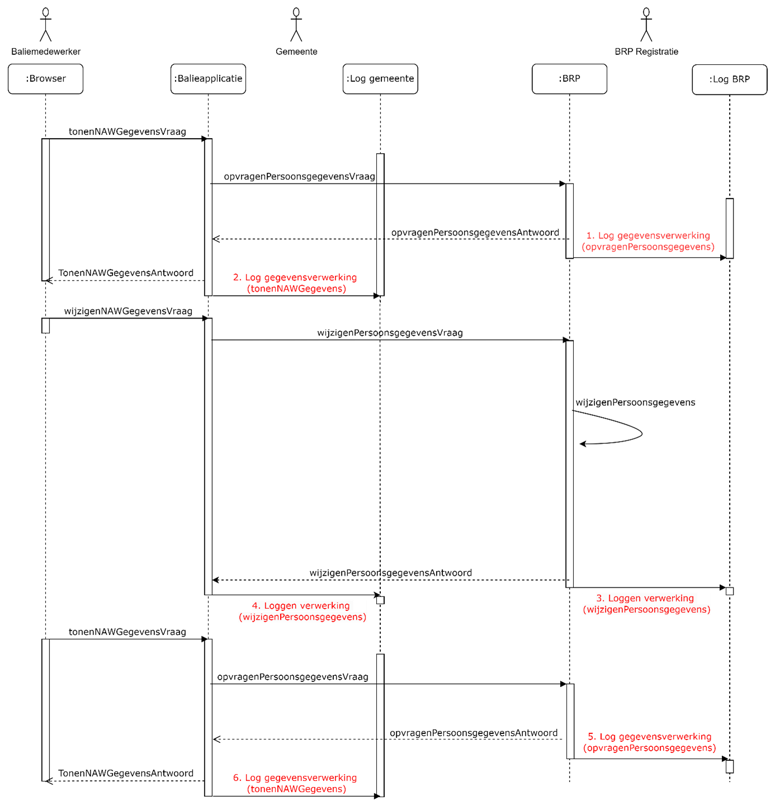

### Logging van gegevens
De volgende gegevens worden gelogd in de diverse logmomenten:
  
**1.	Log opvragenPersoonsgegevens (log BRP):**

| Attribuut   | Waarde   |
|-------------|----------|
| operationId	|7a22eb38-bca6-463f-9955-54ab040287cb|
|operationName	|opvragenPersoonsgegevens|
|parentOperationId	|`<leeg>`|
|traceId	|c6adf4df949d03c662b53e95debdc411|
|startTime	|2024-07-29 08:16:49.000|
|endTime	|2024-07-29 08:16:49.000|
|statusCode	|OK|
|resource.name	|BRP|
|resource.version|	2.0|
|receiver	|`<leeg>`|
|attributeKey	|dplCoreProcessingActivityId|
|attributeValue	|12f2ec2a-0cc4-3541-9ae6-219a178fcfe4|
|attributeKey	|`<leeg>`|
|attributeValue	|`<leeg>`|
|foreignOperation.traceId	|bc9126aaae813fd491ee10bf870db292|
|foreignOperation.operationId	|b2e339a595246e01|

**2.	Log tonenNAWGegevens (log gemeente)**
| Attribuut   | Waarde   |
|-------------|----------|
|operationId	|b2e339a595246e01|
|operationName	|tonenNAWGegevens|
|parentOperationId	|`<leeg>`|
|traceId	|bc9126aaae813fd491ee10bf870db292|
|startTime	|2024-07-29 10:16:49.690|
|endTime	|2024-07-29 10:16:49.723|
|statusCode	|OK|
|resource.name	|Balieapp|
|resource.version	|1.0.5|
|receiver	|27fdey98605etc48|
|attributeKey	|dplCoreProcessingActivityId|
|attributeValue	|11x2ec2a-0774-3541-9b16-21ba179fcf15|
|attributeKey	|dplCoreDataSubjectId|
|attributeValue	|13j2ec27-0cc4-3541-9av6-219a178fcfe5|

**3.	Log wijzigenPersoonsgegevens (log BRP)**
| Attribuut   | Waarde   |
|-------------|----------|
|operationId	|433f276975204ccf|
|operationName	|wijzigenPersoonsgegevens|
|parentOperationId	|`<leeg>`|
|traceId	|8ccfd3c567c51d68937c263e00a352be|
|startTime	|2024-07-29 08:17:02|
|endTime	|2024-07-29 08:17:02|
|statusCode	|OK|
|resource.name	|BRP|
|resource.version	|2.0|
|receiver	|`<leeg>`|
|attributeKey	|dplCoreProcessingActivityId|
|attributeValue	|8c714e4a-a538-36f7-8b1f-37a6884cc68c|
|attributeKey	|`<leeg>`|
|attributeValue	|`<leeg>`|
|foreignOperation.traceId	|f176a58de7fe249ea37ed4f5979da02b|
|foreignOperation.operationId|	414514cf1d40d6b2|

**4.	Log wijzigenPersoonsgegevens (log gemeente)**
| Attribuut   | Waarde   |
|-------------|----------|
|operationId	|414514cf1d40d6b2|
|operationName	|wijzigenPersoonsgegevens|
|parentOperationId	|`<leeg>`|
|traceId	|f176a58de7fe249ea37ed4f5979da02b|
|startTime	|2024-07-29 08:17:02.000|
|endTime	|2024-07-29 08:17:02.000|
|statusCode	|OK|
|resource.name	|Balieapp|
|resource.version	|1.0.5|
|receiver	|`<leeg>`|
|attributeKey	|dplCoreProcessingActivityId|
|attributeValue	|19u2dd2a-0cb7-3541-9ae6-217a178fc9e6|
|attributeKey	|dplCoreDataSubjectId|
|attributeValue	|13j2ec27-0cc4-3541-9av6-219a178fcfe5|
|foreignOperation.traceId	|`<leeg>`|
|foreignOperation.operationId	|`<leeg>`|

**5.	Log opvragenPersoonsgegevens (log BRP)**
| Attribuut   | Waarde   |
|-------------|----------|
|operationId	|7a95b6989d2b28c7|
|operationName	|opvragenPersoonsgegevens|
|parentOperationId	|`<leeg>`|
|traceId	|f176a58de7fe249ea37ed4f5979da02b|
|startTime	|2024-07-29 08:17:02.000|
|endTime	|2024-07-29 08:17:02.000|
|statusCode	|OK|
|resource.name	|BRP|
|resource.version	|2.0|
|receiver	|`<leeg>`|
|attributeKey	|dplCoreProcessingActivityId|
|attributeValue	|0b1ff20a-3ecb-34bf-8cf5-e4cbacb046ab|
|attributeKey	|dplCoreDataSubjectId|
|attributeValue	|`<leeg>`|
|foreignOperation.traceId	|c0a7a38d56f3f16a2163ca0071d3779a|
|foreignOperation.operationId	|df524ee2a3fd5ddf|

**6.	Log tonenNAWGegevens (log gemeente)**
| Attribuut   | Waarde   |
|-------------|----------|
|operationId	|df524ee2a3fd5ddf|
|operationName	|tonenNAWGegevens|
|parentOperationId	|`<leeg>`|
|traceId	|c0a7a38d56f3f16a2163ca0071d3779a|
|startTime	|2024-07-29 10:17:02.010|
|endTime	|2024-07-29 10:17:02.039|
|statusCode|	OK|
|resource.name	|Balieapp|
|resource.version	|1.0.5|
|receiver	|27fdey98605etc48|
|attributeKey	|dplCoreProcessingActivityId|
|attributeValue	|12c21c2a-0875-3543-9b16-21ja179fcf16|
|attributeKey	|dplCoreDataSubjectId|
|attributeValue	|13j2ec27-0cc4-3541-9av6-219a178fcfe5|
|foreignOperation.traceId	|`<leeg>`|
|foreignOperation.operationId	|`<leeg>`|

### Relatie tussen gegevens
Om uiteindelijk alle gegevens te kunnen rapporteren, is het van belang dat gegevens op een bepaalde manier aan elkaar gekoppeld zijn. In dit voorbeeld zijn de gegevens op de volgende manier gekoppeld:
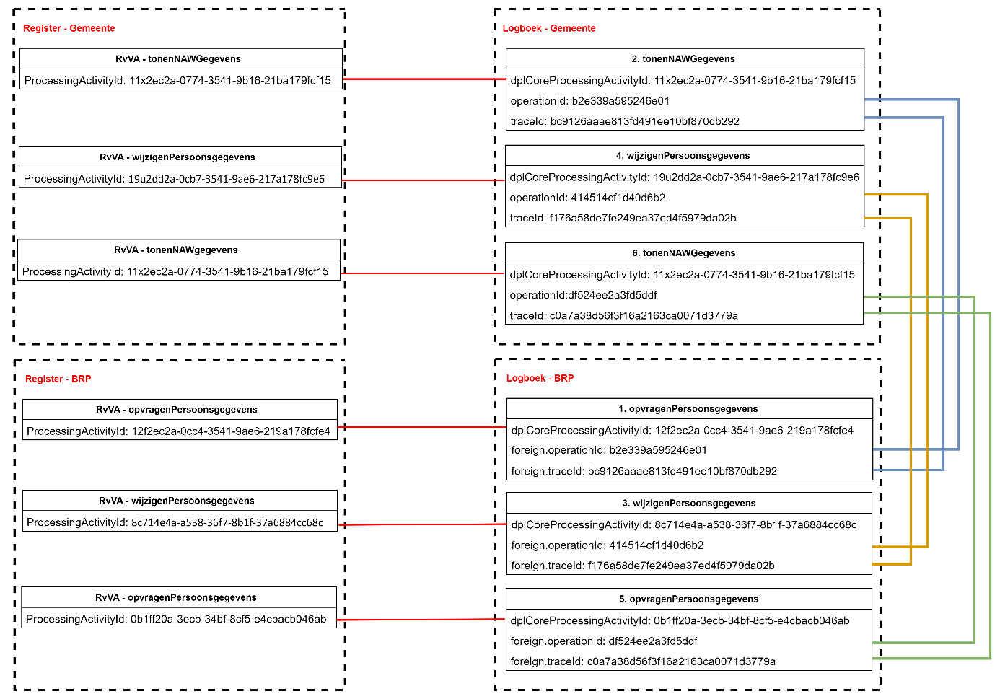

### Relatie met de standaard Logboek dataverwerkingen
De relatie met de doelstellingen die gesteld zijn in de standaard Logboek dataverwerkingen worden, op basis van dit voorbeeld, als volgt concreet gerealiseerd:

**- het wegschrijven van logs van dataverwerkingen:** In dit voorbeeld is het de Baliemedewerker die via een Balieapplicatie de gegevens van een Betrokkene kan bekijken en wijzigen. Deze acties zijn gegevensverwerkingen en worden gelogd bij zowel de Balieapplicatie  als bij het BRP-systeem.

**- het aan elkaar relateren van logs van dataverwerkingen:** Er zijn in dit voorbeeld twee applicaties nodig om het totaal aan gevraagde informatie te kunnen tonen aan de betrokkene. Beide applicaties hebben een logboek voor verwerkte gegevens. Om een totaalbeeld van de gelogde gegevens te kunnen construeren, is een relatie tussen de logs nodig. In dit voorbeeld wordt de koppeling gelegd door het operationId en traceId (gemeentelogboek) te linken aan het foreignOperationId en foreignTraceId (BRP-logboek).

**- het aan elkaar relateren van dataverwerkingen over de grenzen van systemen:** Naast het koppelen van logs van diverse applicaties, wordt ook een koppeling gelegd met het Register van verwerkingsactiviteiten. Dit gebeurt per applicatie op basis van het ProcessingActivityId (register) te koppelen aan dplCoreProcessingActivityId (logboek). De diverse registers hebben **geen** directe koppeling met elkaar.

**Standaard Logverwerkingen: paragraaf 3.3.1 Gedrag**

1. *De applicatie MOET een Trace starten voor iedere Dataverwerking waarvan nog geen Trace bekend is.* Bij elke start van een verwerking wordt een traceId aangemaakt. Bijvoorbeeld: in het voorbeeld komt er een bericht binnen bij de Balieapplicatie van de gemeente (tonenNAWGegevens). Er wordt direct een traceId aangemaakt.

2. *De applicatie MOET voor iedere Dataverwerking een logregel wegschrijven in een Logboek. Log Sampling is niet toegestaan.* Een dataverwerking wordt opgeslagen als deze volledig is afgerond. In het voorbeeld is te zien dat een logregel wordt geschreven op het moment dat de vraag- en het antwoordbericht zijn afgerond.

3. *De applicatie MOET bijhouden of een Dataverwerking geslaagd of mislukt is en dit per Dataverwerking als status meegeven aan het Logboek.* Bij elke logregel in het voorbeeld staat de statusCode vermeld (‘OK’).

4. *Als een Dataverwerking meerdere Betrokkenen heeft dan MOET de applicatie voor iedere betrokkene een aparte logregel wegschrijven. Een logregel kan naar 0 of 1 betrokkenen verwijzen.* In het voorbeeld gaat het om één betrokkene (dplCoreDataSubjectId), er wordt steeds één logregel aangemaakt.

5. *Als een applicatie aangeroepen kan worden vanuit een andere applicatie MOET de applicatie Trace Context metadata accepteren bij een dergelijke aanroepen deze metadata kunnen omzetten naar een foreign_operation bericht.* Bij een externe verwerking (bijvoorbeeld opvragenPersoonsgegevens) geeft de Balieapplicatie de traceId en OperationId mee aan het BRP-systeem. Het BRP-systeem registreert de traceId en operationId beide als ‘foreignOperation’.

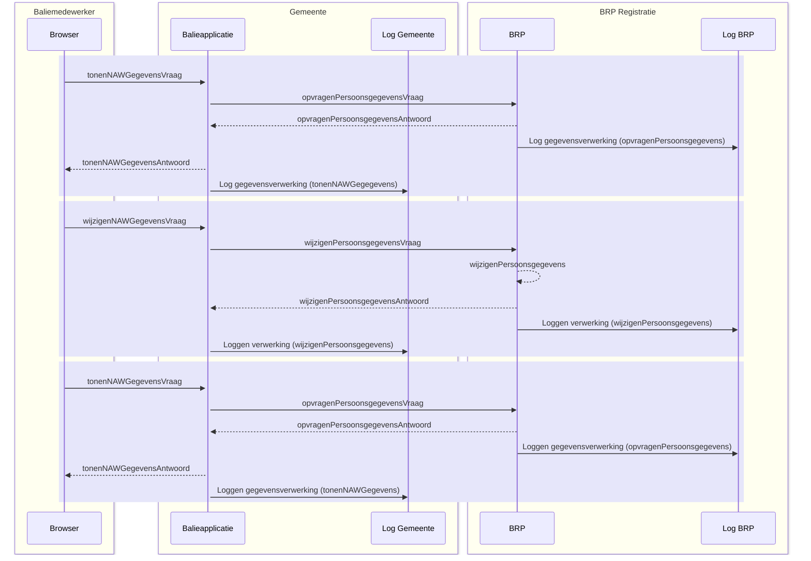

## Registratie verhuizing – Opvragen meerdere BSN’s

### Situatieschets
Deze case beschrijft de samenstelling van een huishouding op een bepaald adres. De beschrijving is functioneel zo eenvoudig mogelijk, een burger komt aan de balie en er is geen sprake van wijzigingen in de huishouding.

### Uitgangspunten

•	Het beschreven proces is een voorbeeld, het werkelijke proces kan anders verlopen.

•	Het proces is een ‘happy flow’ dit betekent dat validaties en eventuele foutsituaties in dit voorbeeld niet in ogenschouw worden genomen.

•	Autorisatieprocessen zijn in dit voorbeeld niet meegenomen.

•	Een Loggingsregel wordt toegevoegd aan het logboek per **geheel** afgeronde transactie. Er wordt dus **geen** aparte logregel aangemaakt per ontvangen of verstuurd bericht.

•	Een aantal gegevens staan nog ter discussie (vanuit juridisch oogpunt). Voor de volledigheid worden een aantal gegevens in dit voorbeeld meegenomen. Het betreft de gegevens:

  o	resource/name/version
  
  o	receiver
  
  o	dataSubject
  
•	Het is optioneel om het BSN-nummer (dplCoreDataSubjectId) te versleutelen ten behoeve van extra gegevensbeveiliging. In dit voorbeeld wordt versleuteling van gegevens toegepast.

### Globaal proces
Schematisch ziet dit proces er als volgt uit:

1.	De Baliemedewerker voert adres van de burger in.
2.	De Browser vraagt om persoonsgegevens bij de gemeentelijke Balieapplicatie.
3.	De gemeentelijke Balieapplicatie vraag persoonsgegevens bij het BRP-systeem.
4.	Het BRP systeem stuurt gevraagde gegevens naar de gemeentelijke Balieapplicatie en logt de aanvraag.
5.	De gemeentelijke Balieapplicatie stuurt de gegevens naar de Browser en worden getoond aan de Baliemedewerker. De aanvraag wordt gelogd door de Balieapplicatie.

Schematisch ziet dit proces er als volgt uit:
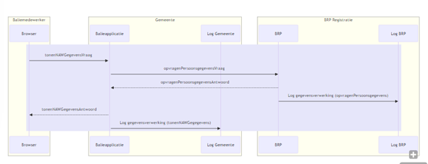

### Logging van gegevens
De volgende gegevens worden gelogd in de diverse logmomenten:

**1.	Log opvragenPersoonsgegevens (log BRP) persoon 1:**
| Attribuut   | Waarde   |
|-------------|----------|
|operationId	|7a22eb38-bca6-463f-9955-54ab040287cb|
|operationName	|opvragenPersoonsgegevens|
|parentOperationId	|`<leeg>`|
|traceId	|c6adf4df949d03c662b53e95debdc411|
|startTime	|2024-07-29 08:16:49.000|
|endTime	|2024-07-29 08:16:49.000|
|statusCode	|OK|
|resource.name	|BRP|
|resource.version|	2.0|
|receiver	|`<leeg>`|
|attributeKey	|dplCoreProcessingActivityId|
|attributeValue	|12f2ec2a-0cc4-3541-9ae6-219a178fcfe4|
|attributeKey	|dplCoreDataSubjectId|
|attributeValue	|ddj2ey299-0cf4-3541-9ar6-21ia178fcfrr|
|foreignOperation.traceId	|bc9126aaae813fd491ee10bf870db292|
|foreignOperation.operationId	|b2e339a595246e01|

**2.	Log opvragenPersoonsgegevens (log BRP) persoon 2:**
| Attribuut   | Waarde   |
|-------------|----------|
|operationId	|7a45638-bca6-463f-www955-54ab04028786|
|operationName	|opvragenPersoonsgegevens|
|parentOperationId	|`<leeg>`|
|traceId	|c6adf4df949d03c662b53e95debdc411|
|startTime	|2024-07-29 08:16:49.000|
|endTime	|2024-07-29 08:16:49.000|
|statusCode	|OK|
|resource.name	|BRP|
|resource.version	|2.0|
|receiver	|`<leeg>`|
|attributeKey|	dplCoreProcessingActivityId|
|attributeValue	|12f2ec2a-0cc4-3541-9ae6-219a178fcfe4|
|attributeKey	|dplCoreDataSubjectId|
|attributeValue	|f4j2ey299-3er4-3aa41-9ar6-21ia178fc3tyy|
|foreignOperation.traceId	|bc9126aaae813fd491ee10bf870db292|
|foreignOperation.operationId	|b2e339a595246e01|

**3.	Log tonenNAWGegevens (log gemeente) persoon 1:**
| Attribuut   | Waarde   |
|-------------|----------|
|operationId	|b2e339a595246e01|
|operationName	|tonenNAWGegevens|
|parentOperationId	|`<leeg>`|
|traceId	|bc9126aaae813fd491ee10bf870db292|
|startTime	|2024-07-29 10:16:49.690|
|endTime	|2024-07-29 10:16:49.723|
|statusCode	|OK|
|resource.name	|Balieapp|
|resource.version	|1.0.5|
|receiver	|27fdey98605etc48|
|attributeKey	|dplCoreProcessingActivityId|
|attributeValue	|11x2ec2a-0774-3541-9b16-21ba179fcf15|
|attributeKey|	dplCoreDataSubjectId|
|attributeValue	|13j2ec27-0cc4-3541-9av6-219a178fcfe5|

**4.	Log tonenNAWGegevens (log gemeente) persoon 2:**
| Attribuut   | Waarde   |
|-------------|----------|
|operationId	|b2e339a595246e01|
|operationName	|tonenNAWGegevens|
|parentOperationId	|`<leeg>`|
|traceId	|bc9126aaae813fd491ee10bf870db292|
|startTime	|2024-07-29 10:16:49.690|
|endTime	|2024-07-29 10:16:49.723|
|statusCode	|OK|
|resource.name	|Balieapp|
|resource.version|	1.0.5|
|receiver	|27fdey98605etc48|
|attributeKey	|dplCoreProcessingActivityId|
|attributeValue	|11x2ec2a-0774-3541-9b16-21ba179fcf15|
|attributeKey	|dplCoreDataSubjectId|
|attributeValue	|342ec27-aa41-dav6-219a178f5ty6|

### Relatie tussen gegevens
Om uiteindelijk alle gegevens te kunnen rapporteren, is het van belang dat gegevens op een bepaalde manier aan elkaar gekoppeld zijn. In dit voorbeeld zijn de gegevens op de volgende manier gekoppeld:
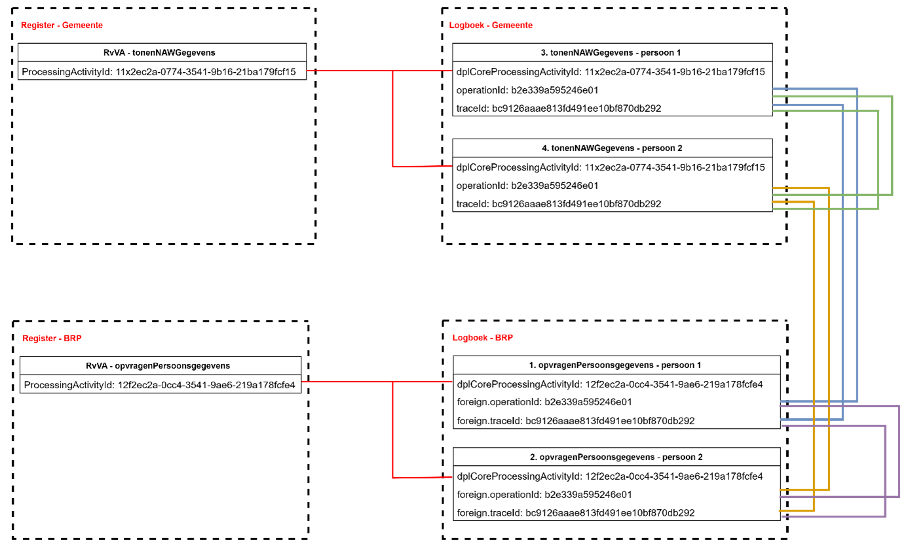

### Relatie met de standaard Logboek dataverwerkingen
De relatie met de doelstellingen die gesteld zijn in de standaard Logboek dataverwerkingen worden, op basis van dit voorbeeld, als volgt concreet gerealiseerd:

**- het wegschrijven van logs van dataverwerkingen:** In dit voorbeeld is het de Baliemedewerker die via een Balieapplicatie de gegevens van een Betrokkene kan bekijken. Deze acties zijn gegevensverwerkingen en worden gelogd bij zowel de Balieapplicatie  als bij het BRP-systeem.

**- het aan elkaar relateren van logs van dataverwerkingen:** Er zijn in dit voorbeeld twee applicaties nodig om het totaal aan gevraagde informatie te kunnen tonen aan de betrokkene. Beide applicaties hebben een logboek voor verwerkte gegevens. Om een totaalbeeld van de gelogde gegevens te kunnen construeren, is een relatie tussen de logs nodig. In dit voorbeeld wordt de koppeling gelegd door het operationId en traceId (gemeentelogboek) te linken aan het foreignOperationId en foreignTraceId (BRP-logboek). De aanroep van de gemeente-applicatie naar het BRP betreft één opvraag op basis van één adres, één operationId en één traceId. Het resultaat is meervoudig en moeten naar dezelfde operationId en traceId leiden van de gemeente-applicatie. Het onderscheid zit in de verschillende BSN’s van de personen.

**- het aan elkaar relateren van dataverwerkingen over de grenzen van systemen:** Naast het koppelen van logs van diverse applicaties, wordt ook een koppeling gelegd met het Register van verwerkingsactiviteiten. Dit gebeurt per applicatie op basis van het ProcessingActivityId (register) te koppelen aan dplCoreProcessingActivityId (logboek). De diverse registers hebben **geen** directe koppeling met elkaar.

**Standaard Logverwerkingen: paragraaf 3.3.1 Gedrag**

1. *De applicatie MOET een Trace starten voor iedere Dataverwerking waarvan nog geen Trace bekend is.* Bij elke start van een verwerking wordt een traceId aangemaakt. Bijvoorbeeld: in het voorbeeld komt er een bericht binnen bij de Balieapplicatie van de gemeente (tonenNAWGegevens). Er wordt direct een traceId aangemaakt.

2. *De applicatie MOET voor iedere Dataverwerking een logregel wegschrijven in een Logboek. Log Sampling is niet toegestaan.* Een dataverwerking wordt opgeslagen als deze volledig is afgerond. In het voorbeeld is te zien dat logregels worden geschreven op het moment dat de vraag- en het antwoordbericht zijn afgerond.

3. *De applicatie MOET bijhouden of een Dataverwerking geslaagd of mislukt is en dit per Dataverwerking als status meegeven aan het Logboek.* Bij elke logregel in het voorbeeld staat de statusCode vermeld (‘OK’).

4. *Als een Dataverwerking meerdere Betrokkenen heeft dan MOET de applicatie voor iedere betrokkene een aparte logregel wegschrijven. Een logregel kan naar 0 of 1 betrokkenen verwijzen.* In het voorbeeld gaat het om twee betrokkenen (dplCoreDataSubjectId), er wordt één logregel aangemaakt per BSN.

5. *Als een applicatie aangeroepen kan worden vanuit een andere applicatie MOET de applicatie Trace Context metadata accepteren bij een dergelijke aanroepen deze metadata kunnen omzetten naar een foreign_operation bericht.* Bij een externe verwerking (bijvoorbeeld opvragenPersoonsgegevens) geeft de Balieapplicatie de traceId en OperationId mee aan het BRP-systeem. Het BRP-systeem registreert de traceId en operationId beide als ‘foreignOperation’.

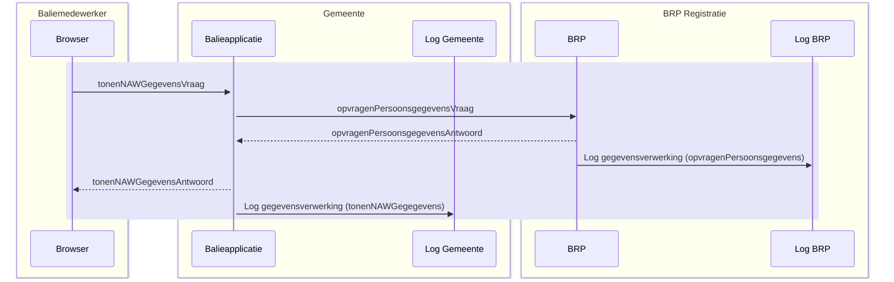

