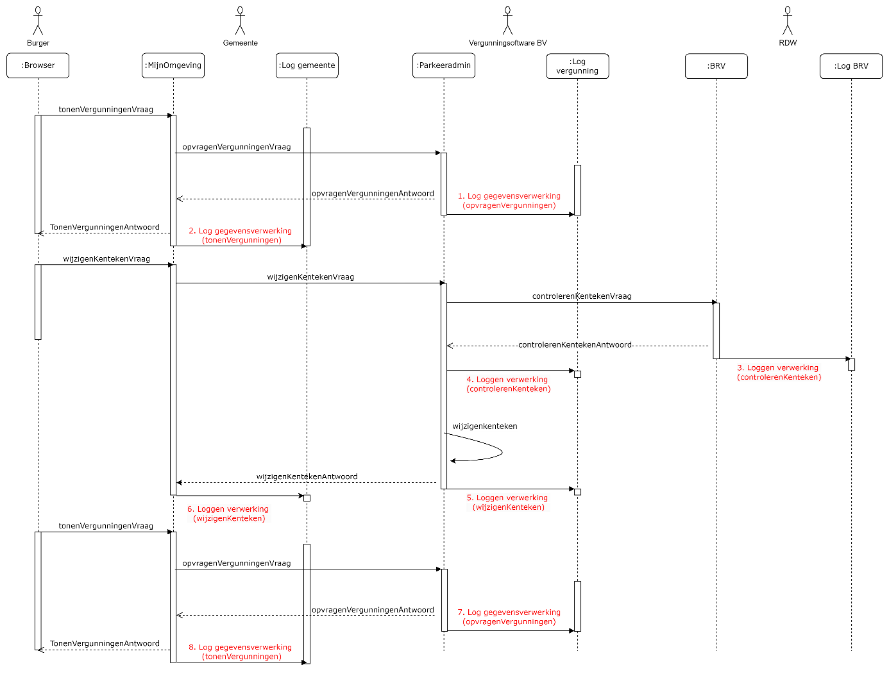

# Voorbeelden

@@@ todo: de volgende vier voorbeelden opnemen:

- [Parkeervergunning – Inzien ](https://www.samenwerkruimten.nl/teamsites/project verwerkingenlogging/Gedeelde  documenten/Informatieanalyse/Cases/Parkeervergunning_Inzien vergunningen.docx?web=1)[parkeervergunning](https://www.samenwerkruimten.nl/teamsites/project verwerkingenlogging/Gedeelde  documenten/Informatieanalyse/Cases/Parkeervergunning_Inzien vergunningen.docx?web=1)

- [Parkeervergunning – Wijzigen ](https://www.samenwerkruimten.nl/teamsites/project verwerkingenlogging/Gedeelde  documenten/Informatieanalyse/Cases/Parkeervergunning_wijzigen vergunningen.docx?web=1)[parkeervergunning](https://www.samenwerkruimten.nl/teamsites/project verwerkingenlogging/Gedeelde  documenten/Informatieanalyse/Cases/Parkeervergunning_wijzigen vergunningen.docx?web=1)

- [Registratie verhuizing – Eenvoudig, traditioneel system](https://www.samenwerkruimten.nl/teamsites/project verwerkingenlogging/Gedeelde  documenten/Informatieanalyse/Cases/Registratie Verhuizing – Eenvoudig, traditioneel systeem.docx?web=1)

- [Registratie verhuizing – Opvragen meerdere BSN’s](https://www.samenwerkruimten.nl/teamsites/project verwerkingenlogging/Gedeelde  documenten/Informatieanalyse/Cases/Registratie Verhuizing – opvragen meerdere BSN's.docx?d=wfab71607179442769b593757fb04dcb3)

## Parkeervergunning - inzien

### Situatieschets
Een persoon heeft bij een gemeente een parkeervergunning in gebruik en wil de gegevens van deze vergunning bekijken.

### Uitgangspunten
* Het beschreven proces is een voorbeeld, het werkelijke proces kan anders verlopen.

* Het proces is een ‘happy flow’ dit betekent dat validaties en eventuele foutsituaties in dit voorbeeld niet in ogenschouw worden genomen.

* Autorisatieprocessen zijn in dit voorbeeld niet meegenomen.

* Een Loggingsregel wordt toegevoegd aan het logboek per geheel afgeronde transactie. Er wordt dus geen aparte logregel aangemaakt per ontvangen of verstuurd bericht.

* Een aantal gegevens staan nog ter discussie (vanuit juridisch oogpunt). Voor de volledigheid worden een aantal gegevens in dit voorbeeld meegenomen. Het betreft de gegevens:

o resource/name/version

o receiver

o dataSubject

### Globaal proces
1. Een persoon vraagt in zijn ‘MijnOmgeving’ van de gemeente om de bestaande parkeervergunninggegevens.

2. De ‘MijnOmgeving’ van de gemeente verzoekt de parkeervergunningapplicatie om de actuele parkeervergunninggegevens van de persoon.

3. Het parkeervergunningsysteem voert dit verzoek uit. Daarna verzendt de parkeervergunningapplicatie de gevraagde gegevens naar de gemeente. Het parkeervergunningensysteem logt dat er gegevens verzonden zijn naar de gemeente.

4. De gemeente toont de gegevens aan de persoon en logt dat deze gegevens zijn getoond aan de persoon.

Schematisch ziet dit proces er als volgt uit:

### Logging van gegevens
De volgende gegevens worden gelogd in de diverse logmomenten:

**1.	Log opvragenVergunningen (log vergunningenapplicatie):**

| Attribuut   | Waarde   |
|-------------|----------|
| operationId	| |8ee7b01aca8d01d9 |
operationName	opvragenVergunningen
parentOperationId	<leeg>
traceId	c6adf4df949d03c662b53e95debdc411
startTime	2024-07-29 08:16:49.000
endTime	2024-07-29 08:16:49.000
statusCode	OK
resource.name	Parkeeradmin
resource.version	2.1.6
receiver	<leeg>
attributeKey	dplCoreProcessingActivityId
attributeValue	12f2ec2a-0cc4-3541-9ae6-219a178fcfe4
attributeKey	<leeg>
attributeValue	<leeg>
foreignOperation.traceId	bc9126aaae813fd491ee10bf870db292
foreignOperation.operationId	b2e339a595246e01

