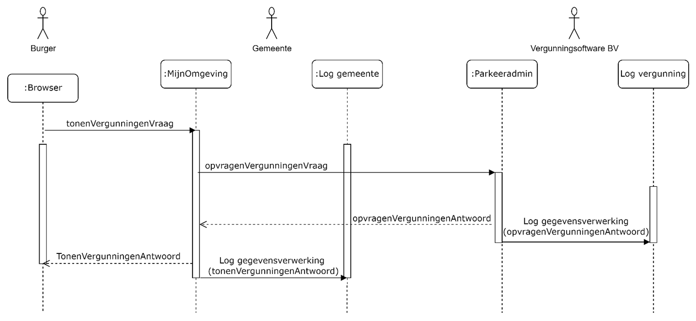

## Parkeervergunning - inzien
### Situatieschets
Een persoon heeft bij een gemeente een parkeervergunning in gebruik en wil de gegevens van deze vergunning bekijken.

### Uitgangspunten
•	Het beschreven proces is een voorbeeld, het werkelijke proces kan anders verlopen.

•	Het proces is een ‘happy flow’ dit betekent dat validaties en eventuele foutsituaties in dit voorbeeld niet in ogenschouw worden genomen.

•	Autorisatieprocessen zijn in dit voorbeeld niet meegenomen.

•	Een Loggingsregel wordt toegevoegd aan het logboek per **geheel** afgeronde transactie. Er wordt dus **geen** aparte logregel aangemaakt per ontvangen of verstuurd bericht.

•	Een aantal gegevens staan nog ter discussie (vanuit juridisch oogpunt). Voor de volledigheid worden een aantal gegevens in dit voorbeeld meegenomen. Het betreft de gegevens:

o	resource/name/version

o	receiver

o	dataSubject

### Globaal proces
1.	Een persoon vraagt in zijn ‘MijnOmgeving’ van de gemeente om de bestaande parkeervergunninggegevens.
   
2.	De ‘MijnOmgeving’ van de gemeente verzoekt de parkeervergunningapplicatie om de actuele parkeervergunninggegevens van de persoon.

3.	Het parkeervergunningsysteem voert dit verzoek uit. Daarna verzendt de parkeervergunningapplicatie de gevraagde gegevens naar de gemeente. Het parkeervergunningensysteem logt dat er gegevens verzonden zijn naar de gemeente.

4.	De gemeente toont de gegevens aan de persoon en logt dat deze gegevens zijn getoond aan de persoon.

Schematisch ziet dit proces er als volgt uit:

### Logging van gegevens
De volgende gegevens worden gelogd in de diverse logmomenten:

**Log opvragenVergunningen (log vergunningenapplicatie):**
| Attribuut   | Waarde   |
|-------------|----------|
|operationId	|8451dcd9ede037cb|
|operationName	|opvragenVergunningen|
|parentOperationId	|`<leeg>`|
|traceId	|ccf5064a324163ed939bfa09c2bcb210|
|startTime	|2024-05-30 08:40:37.000|
|endTime	|2024-05-30 08:40:37.000|
|statusCode	|OK|
|resource.name	|Parkeeradmin|
|resource.version	|2.1.6|
|receiver|	`<leeg>`|
|attributeKey	|dplCoreProcessingActivityId|
|attributeValue	|rva:12f2ec2a-0cc4-3541-9ae6-219a178fcfe4|
|attributeKey	|`<leeg>`|
|attributeValue	|`<leeg>`|
|foreignOperation.traceId	|c7a26dcd0bee0c8900e2174c43c3393c|
|foreignOperation.operationId|	9f8971bfd093637d|

**Log opvragenVergunningen (log gemeente)**
| Attribuut   | Waarde   |
|-------------|----------|
|operationId	|9f8971bfd093637d|
|operationName	|tonenVergunningen|
|parentOperationId|	`<leeg>`|
|traceId	|c7a26dcd0bee0c8900e2174c43c3393c|
|startTime	|2024-05-30 10:40:37.821|
|endTime	|2024-05-30 10:40:37.845|
|statusCode	|OK|
|resource.name	|MijnOmgeving|
|resource.version	|1.0.5|
|receiver	|27fdey98605etc48|
|attributeKey	|dplCoreProcessingActivityId|
|attributeValue	|rva:11x2ec2a-0774-3541-9b16-21ba179fcf15|
|attributeKey	|dplCoreDataSubjectId|
|attributeValue	|rva:13j2ec27-0cc4-3541-9av6-219a178fcfe5|

### Relatie tussen gegevens

Om uiteindelijk alle gegevens te kunnen rapporteren, is het van belang dat gegevens op een bepaalde manier aan elkaar gekoppeld zijn. In dit voorbeeld zijn de gegevens op de volgende manier gekoppeld:

### Relatie met de standaard Logboek dataverwerkingen
De relatie met de doelstellingen die gesteld zijn in de standaard Logboek dataverwerkingen worden, op basis van dit voorbeeld, als volgt concreet gerealiseerd:

**- het wegschrijven van logs van dataverwerkingen:** In dit voorbeeld is het de betrokkene zelf die via een portaal zijn eigen gegevens kan bekijken. Deze actie is een gegevensverwerking en wordt gelogd bij zowel de gemeenteapplicatie (gegevens worden getoond aan de betrokkene) als bij de vergunningenapplicatie (verstrekking specifieke informatie aan de gemeenteapplicatie).

**- het aan elkaar relateren van logs van dataverwerkingen:** Er zijn in dit voorbeeld twee applicaties nodig om het totaal aan gevraagde informatie te kunnen tonen aan de betrokkene. Beide applicaties hebben een logboek voor verwerkte gegevens. Om een totaalbeeld van de gelogde gegevens te kunnen construeren, is een relatie tussen de logs nodig. In dit voorbeeld wordt de koppeling gelegd door het operationId en traceId (gemeentelogboek) te linken aan het foreignOperationId en foreignTraceId (vergunningenlogboek).

**- het aan elkaar relateren van dataverwerkingen over de grenzen van systemen:** Naast het koppelen van logs van diverse applicaties, wordt ook een koppeling gelegd met het Register van verwerkingsactiviteiten. Dit gebeurt per applicatie op basis van het ProcessingActivityId (register) te koppelen aan dplCoreProcessingActivityId (logboek). De diverse registers hebben **geen** directe koppeling met elkaar.

**Standaard Logverwerkingen: paragraaf 3.3.1 Gedrag**

1.De applicatie MOET een Trace starten voor iedere Dataverwerking waarvan nog geen Trace bekend is. Bij elke start van een verwerking wordt een traceId aangemaakt. Bijvoorbeeld: in het voorbeeld komt er een bericht binnen bij de ‘MijnOmgeving’ van de gemeente (opvragenVergunningenVraag). Er wordt direct een traceId aangemaakt.

2.De applicatie MOET voor iedere Dataverwerking een logregel wegschrijven in een Logboek. Log Sampling is niet toegestaan. Een dataverwerking wordt opgeslagen als deze volledig is afgerond. In het voorbeeld is te zien dat een logregel wordt geschreven op het moment dat de vraag- en het antwoordbericht zijn afgerond.

3.De applicatie MOET bijhouden of een Dataverwerking geslaagd of mislukt is en dit per Dataverwerking als status meegeven aan het Logboek. Bij elke logregel in het voorbeeld staat de statusCode vermeld (‘OK’).

4.Als een Dataverwerking meerdere Betrokkenen heeft dan MOET de applicatie voor iedere betrokkene een aparte logregel wegschrijven. Een logregel kan naar 0 of 1 betrokkenen verwijzen. In het voorbeeld gaat het om één betrokkene (dplCoreDataSubjectId), er wordt steeds één logregel aangemaakt.

5.Als een applicatie aangeroepen kan worden vanuit een andere applicatie MOET de applicatie Trace Context metadata accepteren bij een dergelijke aanroepen deze metadata kunnen omzetten naar een foreign_operation bericht. Bij een externe verwerking (bijvoorbeeld opvragenVergunningen) geeft de ‘MijnOmgeving’ de traceId en OperationId mee aan de Vergunningenapplicatie. De vergunningenapplicatie registreert de traceId en operationId beide als ‘foreignOperation’.

