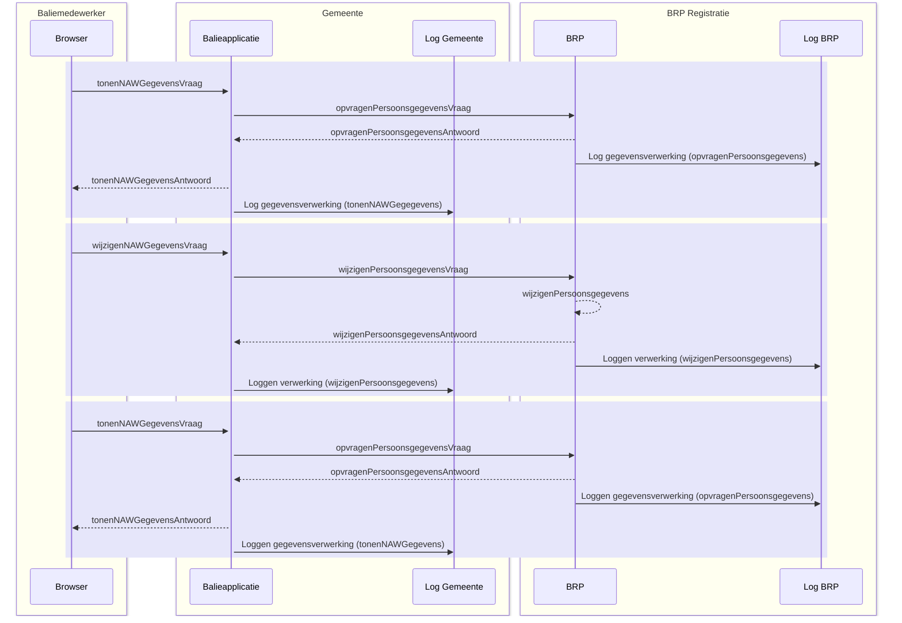

## Registratie Verhuizing - Eenvoudig, traditioneel systeem

### Situatieschets
Deze case beschrijft de binnengemeentelijke verhuizing van een persoon. De beschrijving is functioneel zo eenvoudig mogelijk. De burger komt aan de balie en er is geen sprake van meeverhuizende gezinsleden.

### Uitgangspunten

•	Het beschreven proces is een voorbeeld, het werkelijke proces kan anders verlopen.

•	Het proces is een ‘happy flow’ dit betekent dat validaties en eventuele foutsituaties in dit voorbeeld niet in ogenschouw worden genomen.

•	Autorisatieprocessen zijn in dit voorbeeld niet meegenomen.

•	Een Loggingsregel wordt toegevoegd aan het logboek per **geheel** afgeronde transactie. Er wordt dus **geen** aparte logregel aangemaakt per ontvangen of verstuurd bericht.

•	Een aantal gegevens staan nog ter discussie (vanuit juridisch oogpunt). Voor de volledigheid worden een aantal gegevens in dit voorbeeld meegenomen. Het betreft de gegevens:

  o	resource/name/version
  
  o	receiver
  
  o	dataSubject

### Globaal proces

Schematisch ziet dit proces er als volgt uit:

1.	De Baliemedewerker voert BSN van de burger in.
2.	De Browser vraagt om persoonsgegevens bij de gemeentelijke Balieapplicatie.
3.	De gemeentelijke Balieapplicatie vraag persoonsgegevens bij het BRP-systeem.
4.	Het BRP systeem stuurt gevraagde gegevens naar de gemeentelijke Balieapplicatie en logt de aanvraag.
5.	De gemeentelijke Balieapplicatie stuurt de gegevens naar de Browser en worden getoond aan de Baliemedewerker. De aanvraag wordt gelogd door de Balieapplicatie.
6.	De Baliemedewerker voert de wijziging in en de Browser verstuurt de gegevens naar de gemeentelijke Balieapplicatie.
7.	De gemeentelijke Balieapplicatie verstuurt de gegevens naar het BRP-systeem.
8.	Het BRP-systeem verwerkt de wijziging, stuurt bevestiging terug naar de gemeentelijke Balieapplicatie en logt de verwerkingsactie.
9.	De Browser vraagt de actuele persoonsgegevens op de gemeentelijke Balieapplicatie.
10.	De gemeentelijke Balieapplicatie vraagt de persoonsgegevens op bij het BRP-systeem.
11.	Het BRP-systeem stuurt de persoonsgegevens naar de gemeentelijke Balieapplicatie en logt de aanvraag.
12.	De gemeentelijke Balieapplicatie stuurt de persoonsgegevens naar de Browser en logt de aanvraag.
    
Schematisch ziet dit proces er als volgt uit:

### Logging van gegevens
De volgende gegevens worden gelogd in de diverse logmomenten:
  
**1.	Log opvragenPersoonsgegevens (log BRP):**

| Attribuut   | Waarde   |
|-------------|----------|
| operationId	|7a22eb38-bca6-463f-9955-54ab040287cb|
|operationName	|opvragenPersoonsgegevens|
|parentOperationId	|`<leeg>`|
|traceId	|c6adf4df949d03c662b53e95debdc411|
|startTime	|2024-07-29 08:16:49.000|
|endTime	|2024-07-29 08:16:49.000|
|statusCode	|OK|
|resource.name	|BRP|
|resource.version|	2.0|
|receiver	|`<leeg>`|
|attributeKey	|dplCoreProcessingActivityId|
|attributeValue	|12f2ec2a-0cc4-3541-9ae6-219a178fcfe4|
|attributeKey	|`<leeg>`|
|attributeValue	|`<leeg>`|
|foreignOperation.traceId	|bc9126aaae813fd491ee10bf870db292|
|foreignOperation.operationId	|b2e339a595246e01|

**2.	Log tonenNAWGegevens (log gemeente)**
| Attribuut   | Waarde   |
|-------------|----------|
|operationId	|b2e339a595246e01|
|operationName	|tonenNAWGegevens|
|parentOperationId	|`<leeg>`|
|traceId	|bc9126aaae813fd491ee10bf870db292|
|startTime	|2024-07-29 10:16:49.690|
|endTime	|2024-07-29 10:16:49.723|
|statusCode	|OK|
|resource.name	|Balieapp|
|resource.version	|1.0.5|
|receiver	|27fdey98605etc48|
|attributeKey	|dplCoreProcessingActivityId|
|attributeValue	|11x2ec2a-0774-3541-9b16-21ba179fcf15|
|attributeKey	|dplCoreDataSubjectId|
|attributeValue	|13j2ec27-0cc4-3541-9av6-219a178fcfe5|

**3.	Log wijzigenPersoonsgegevens (log BRP)**
| Attribuut   | Waarde   |
|-------------|----------|
|operationId	|433f276975204ccf|
|operationName	|wijzigenPersoonsgegevens|
|parentOperationId	|`<leeg>`|
|traceId	|8ccfd3c567c51d68937c263e00a352be|
|startTime	|2024-07-29 08:17:02|
|endTime	|2024-07-29 08:17:02|
|statusCode	|OK|
|resource.name	|BRP|
|resource.version	|2.0|
|receiver	|`<leeg>`|
|attributeKey	|dplCoreProcessingActivityId|
|attributeValue	|8c714e4a-a538-36f7-8b1f-37a6884cc68c|
|attributeKey	|`<leeg>`|
|attributeValue	|`<leeg>`|
|foreignOperation.traceId	|f176a58de7fe249ea37ed4f5979da02b|
|foreignOperation.operationId|	414514cf1d40d6b2|

**4.	Log wijzigenPersoonsgegevens (log gemeente)**
| Attribuut   | Waarde   |
|-------------|----------|
|operationId	|414514cf1d40d6b2|
|operationName	|wijzigenPersoonsgegevens|
|parentOperationId	|`<leeg>`|
|traceId	|f176a58de7fe249ea37ed4f5979da02b|
|startTime	|2024-07-29 08:17:02.000|
|endTime	|2024-07-29 08:17:02.000|
|statusCode	|OK|
|resource.name	|Balieapp|
|resource.version	|1.0.5|
|receiver	|`<leeg>`|
|attributeKey	|dplCoreProcessingActivityId|
|attributeValue	|19u2dd2a-0cb7-3541-9ae6-217a178fc9e6|
|attributeKey	|dplCoreDataSubjectId|
|attributeValue	|13j2ec27-0cc4-3541-9av6-219a178fcfe5|
|foreignOperation.traceId	|`<leeg>`|
|foreignOperation.operationId	|`<leeg>`|

**5.	Log opvragenPersoonsgegevens (log BRP)**
| Attribuut   | Waarde   |
|-------------|----------|
|operationId	|7a95b6989d2b28c7|
|operationName	|opvragenPersoonsgegevens|
|parentOperationId	|`<leeg>`|
|traceId	|f176a58de7fe249ea37ed4f5979da02b|
|startTime	|2024-07-29 08:17:02.000|
|endTime	|2024-07-29 08:17:02.000|
|statusCode	|OK|
|resource.name	|BRP|
|resource.version	|2.0|
|receiver	|`<leeg>`|
|attributeKey	|dplCoreProcessingActivityId|
|attributeValue	|0b1ff20a-3ecb-34bf-8cf5-e4cbacb046ab|
|attributeKey	|dplCoreDataSubjectId|
|attributeValue	|`<leeg>`|
|foreignOperation.traceId	|c0a7a38d56f3f16a2163ca0071d3779a|
|foreignOperation.operationId	|df524ee2a3fd5ddf|

**6.	Log tonenNAWGegevens (log gemeente)**
| Attribuut   | Waarde   |
|-------------|----------|
|operationId	|df524ee2a3fd5ddf|
|operationName	|tonenNAWGegevens|
|parentOperationId	|`<leeg>`|
|traceId	|c0a7a38d56f3f16a2163ca0071d3779a|
|startTime	|2024-07-29 10:17:02.010|
|endTime	|2024-07-29 10:17:02.039|
|statusCode|	OK|
|resource.name	|Balieapp|
|resource.version	|1.0.5|
|receiver	|27fdey98605etc48|
|attributeKey	|dplCoreProcessingActivityId|
|attributeValue	|12c21c2a-0875-3543-9b16-21ja179fcf16|
|attributeKey	|dplCoreDataSubjectId|
|attributeValue	|13j2ec27-0cc4-3541-9av6-219a178fcfe5|
|foreignOperation.traceId	|`<leeg>`|
|foreignOperation.operationId	|`<leeg>`|

### Relatie tussen gegevens
Om uiteindelijk alle gegevens te kunnen rapporteren, is het van belang dat gegevens op een bepaalde manier aan elkaar gekoppeld zijn. In dit voorbeeld zijn de gegevens op de volgende manier gekoppeld:

### Relatie met de standaard Logboek dataverwerkingen
De relatie met de doelstellingen die gesteld zijn in de standaard Logboek dataverwerkingen worden, op basis van dit voorbeeld, als volgt concreet gerealiseerd:

**- het wegschrijven van logs van dataverwerkingen:** In dit voorbeeld is het de Baliemedewerker die via een Balieapplicatie de gegevens van een Betrokkene kan bekijken en wijzigen. Deze acties zijn gegevensverwerkingen en worden gelogd bij zowel de Balieapplicatie  als bij het BRP-systeem.

**- het aan elkaar relateren van logs van dataverwerkingen:** Er zijn in dit voorbeeld twee applicaties nodig om het totaal aan gevraagde informatie te kunnen tonen aan de betrokkene. Beide applicaties hebben een logboek voor verwerkte gegevens. Om een totaalbeeld van de gelogde gegevens te kunnen construeren, is een relatie tussen de logs nodig. In dit voorbeeld wordt de koppeling gelegd door het operationId en traceId (gemeentelogboek) te linken aan het foreignOperationId en foreignTraceId (BRP-logboek).

**- het aan elkaar relateren van dataverwerkingen over de grenzen van systemen:** Naast het koppelen van logs van diverse applicaties, wordt ook een koppeling gelegd met het Register van verwerkingsactiviteiten. Dit gebeurt per applicatie op basis van het ProcessingActivityId (register) te koppelen aan dplCoreProcessingActivityId (logboek). De diverse registers hebben **geen** directe koppeling met elkaar.

**Standaard Logverwerkingen: paragraaf 3.3.1 Gedrag**

1. *De applicatie MOET een Trace starten voor iedere Dataverwerking waarvan nog geen Trace bekend is.* Bij elke start van een verwerking wordt een traceId aangemaakt. Bijvoorbeeld: in het voorbeeld komt er een bericht binnen bij de Balieapplicatie van de gemeente (tonenNAWGegevens). Er wordt direct een traceId aangemaakt.

2. *De applicatie MOET voor iedere Dataverwerking een logregel wegschrijven in een Logboek. Log Sampling is niet toegestaan.* Een dataverwerking wordt opgeslagen als deze volledig is afgerond. In het voorbeeld is te zien dat een logregel wordt geschreven op het moment dat de vraag- en het antwoordbericht zijn afgerond.

3. *De applicatie MOET bijhouden of een Dataverwerking geslaagd of mislukt is en dit per Dataverwerking als status meegeven aan het Logboek.* Bij elke logregel in het voorbeeld staat de statusCode vermeld (‘OK’).

4. *Als een Dataverwerking meerdere Betrokkenen heeft dan MOET de applicatie voor iedere betrokkene een aparte logregel wegschrijven. Een logregel kan naar 0 of 1 betrokkenen verwijzen.* In het voorbeeld gaat het om één betrokkene (dplCoreDataSubjectId), er wordt steeds één logregel aangemaakt.

5. *Als een applicatie aangeroepen kan worden vanuit een andere applicatie MOET de applicatie Trace Context metadata accepteren bij een dergelijke aanroepen deze metadata kunnen omzetten naar een foreign_operation bericht.* Bij een externe verwerking (bijvoorbeeld opvragenPersoonsgegevens) geeft de Balieapplicatie de traceId en OperationId mee aan het BRP-systeem. Het BRP-systeem registreert de traceId en operationId beide als ‘foreignOperation’.

