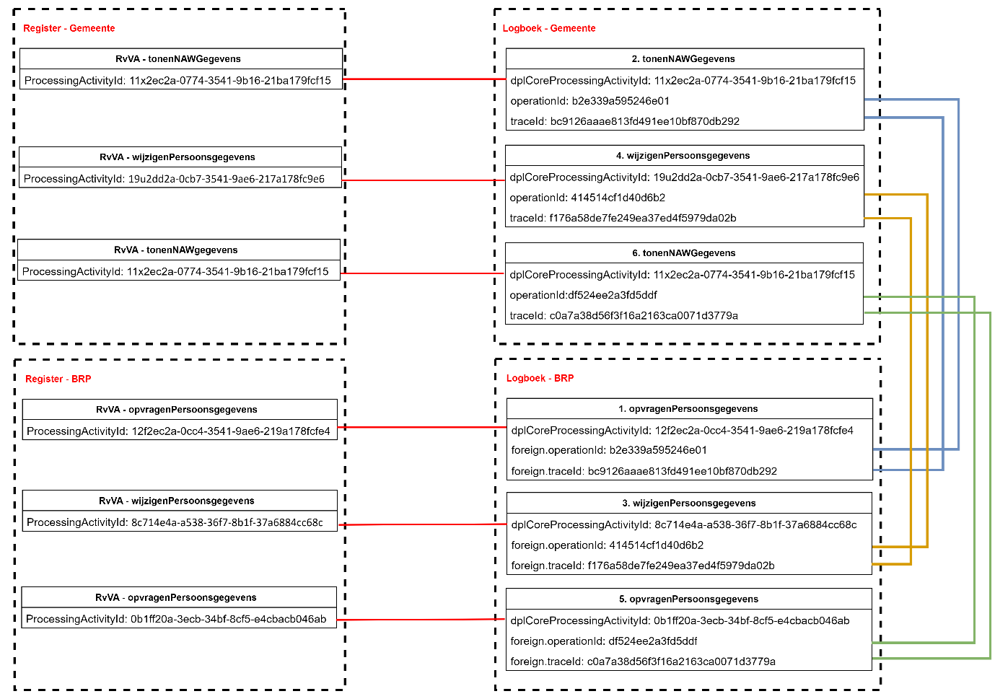

## Registratie Verhuizing - Eenvoudig, traditioneel systeem

### Situatieschets
Deze case beschrijft de binnengemeentelijke verhuizing van een persoon. De beschrijving is functioneel zo eenvoudig mogelijk. De burger komt aan de balie en er is geen sprake van meeverhuizende gezinsleden.

### Uitgangspunten

•	Het beschreven proces is een voorbeeld, het werkelijke proces kan anders verlopen.

•	Het proces is een ‘happy flow’ dit betekent dat validaties en eventuele foutsituaties in dit voorbeeld niet in ogenschouw worden genomen.

•	Autorisatieprocessen zijn in dit voorbeeld niet meegenomen.

•	Een Loggingsregel wordt toegevoegd aan het logboek per **geheel** afgeronde transactie. Er wordt dus **geen** aparte logregel aangemaakt per ontvangen of verstuurd bericht.

•	Een aantal gegevens staan nog ter discussie (vanuit juridisch oogpunt). Voor de volledigheid worden een aantal gegevens in dit voorbeeld meegenomen. Het betreft de gegevens:

  o	resource/name/version
  
  o	receiver
  
  o	dataSubject

### Globaal proces

Schematisch ziet dit proces er als volgt uit:

1.	De Baliemedewerker voert BSN van de burger in.
2.	De Browser vraagt om persoonsgegevens bij de gemeentelijke Balieapplicatie.
3.	De gemeentelijke Balieapplicatie vraag persoonsgegevens bij het BRP-systeem.
4.	Het BRP systeem stuurt gevraagde gegevens naar de gemeentelijke Balieapplicatie en logt de aanvraag.
5.	De gemeentelijke Balieapplicatie stuurt de gegevens naar de Browser en worden getoond aan de Baliemedewerker. De aanvraag wordt gelogd door de Balieapplicatie.
6.	De Baliemedewerker voert de wijziging in en de Browser verstuurt de gegevens naar de gemeentelijke Balieapplicatie.
7.	De gemeentelijke Balieapplicatie verstuurt de gegevens naar het BRP-systeem.
8.	Het BRP-systeem verwerkt de wijziging, stuurt bevestiging terug naar de gemeentelijke Balieapplicatie en logt de verwerkingsactie.
9.	De Browser vraagt de actuele persoonsgegevens op de gemeentelijke Balieapplicatie.
10.	De gemeentelijke Balieapplicatie vraagt de persoonsgegevens op bij het BRP-systeem.
11.	Het BRP-systeem stuurt de persoonsgegevens naar de gemeentelijke Balieapplicatie en logt de aanvraag.
12.	De gemeentelijke Balieapplicatie stuurt de persoonsgegevens naar de Browser en logt de aanvraag.
    
Schematisch ziet dit proces er als volgt uit:

### Logging van gegevens
De volgende gegevens worden gelogd in de diverse logmomenten:
  
**1.	Log opvragenPersoonsgegevens (log BRP):**

| Attribuut   | Waarde   |
|-------------|----------|
| operationId	|7a22eb38-bca6-463f-9955-54ab040287cb|
|operationName	|opvragenPersoonsgegevens|
|parentOperationId	|`<leeg>`|
|traceId	|c6adf4df949d03c662b53e95debdc411|
|startTime	|2024-07-29 08:16:49.000|
|endTime	|2024-07-29 08:16:49.000|
|statusCode	|OK|
|resource.name	|BRP|
|resource.version|	2.0|
|receiver	|`<leeg>`|
|attributeKey	|dplCoreProcessingActivityId|
|attributeValue	|12f2ec2a-0cc4-3541-9ae6-219a178fcfe4|
|attributeKey	|`<leeg>`|
|attributeValue	|`<leeg>`|
|foreignOperation.traceId	|bc9126aaae813fd491ee10bf870db292|
|foreignOperation.operationId	|b2e339a595246e01|

**2.	Log tonenNAWGegevens (log gemeente)**
| Attribuut   | Waarde   |
|-------------|----------|
|operationId	|b2e339a595246e01|
|operationName	|tonenNAWGegevens|
|parentOperationId	|`<leeg>`|
|traceId	|bc9126aaae813fd491ee10bf870db292|
|startTime	|2024-07-29 10:16:49.690|
|endTime	|2024-07-29 10:16:49.723|
|statusCode	|OK|
|resource.name	|Balieapp|
|resource.version	|1.0.5|
|receiver	|27fdey98605etc48|
|attributeKey	|dplCoreProcessingActivityId|
|attributeValue	|11x2ec2a-0774-3541-9b16-21ba179fcf15|
|attributeKey	|dplCoreDataSubjectId|
|attributeValue	|13j2ec27-0cc4-3541-9av6-219a178fcfe5|

**3.	Log wijzigenPersoonsgegevens (log BRP)**
| Attribuut   | Waarde   |
|-------------|----------|
|operationId	|433f276975204ccf|
|operationName	|wijzigenPersoonsgegevens|
|parentOperationId	|`<leeg>`|
|traceId	|8ccfd3c567c51d68937c263e00a352be|
|startTime	|2024-07-29 08:17:02|
|endTime	|2024-07-29 08:17:02|
|statusCode	|OK|
|resource.name	|BRP|
|resource.version	|2.0|
|receiver	|`<leeg>`|
|attributeKey	|dplCoreProcessingActivityId|
|attributeValue	|8c714e4a-a538-36f7-8b1f-37a6884cc68c|
|attributeKey	|`<leeg>`|
|attributeValue	|`<leeg>`|
|foreignOperation.traceId	|f176a58de7fe249ea37ed4f5979da02b|
|foreignOperation.operationId|	414514cf1d40d6b2|

**4.	Log wijzigenPersoonsgegevens (log gemeente)**
| Attribuut   | Waarde   |
|-------------|----------|
|operationId	|414514cf1d40d6b2|
|operationName	|wijzigenPersoonsgegevens|
|parentOperationId	|`<leeg>`|
|traceId	|f176a58de7fe249ea37ed4f5979da02b|
|startTime	|2024-07-29 08:17:02.000|
|endTime	|2024-07-29 08:17:02.000|
|statusCode	|OK|
|resource.name	|Balieapp|
|resource.version	|1.0.5|
|receiver	|`<leeg>`|
|attributeKey	|dplCoreProcessingActivityId|
|attributeValue	|19u2dd2a-0cb7-3541-9ae6-217a178fc9e6|
|attributeKey	|dplCoreDataSubjectId|
|attributeValue	|13j2ec27-0cc4-3541-9av6-219a178fcfe5|
|foreignOperation.traceId	|`<leeg>`|
|foreignOperation.operationId	|`<leeg>`|

**5.	Log opvragenPersoonsgegevens (log BRP)**
| Attribuut   | Waarde   |
|-------------|----------|
|operationId	|7a95b6989d2b28c7|
|operationName	|opvragenPersoonsgegevens|
|parentOperationId	|`<leeg>`|
|traceId	|f176a58de7fe249ea37ed4f5979da02b|
|startTime	|2024-07-29 08:17:02.000|
|endTime	|2024-07-29 08:17:02.000|
|statusCode	|OK|
|resource.name	|BRP|
|resource.version	|2.0|
|receiver	|`<leeg>`|
|attributeKey	|dplCoreProcessingActivityId|
|attributeValue	|0b1ff20a-3ecb-34bf-8cf5-e4cbacb046ab|
|attributeKey	|dplCoreDataSubjectId|
|attributeValue	|`<leeg>`|
|foreignOperation.traceId	|c0a7a38d56f3f16a2163ca0071d3779a|
|foreignOperation.operationId	|df524ee2a3fd5ddf|

**6.	Log tonenNAWGegevens (log gemeente)**
| Attribuut   | Waarde   |
|-------------|----------|
|operationId	|df524ee2a3fd5ddf|
|operationName	|tonenNAWGegevens|
|parentOperationId	|`<leeg>`|
|traceId	|c0a7a38d56f3f16a2163ca0071d3779a|
|startTime	|2024-07-29 10:17:02.010|
|endTime	|2024-07-29 10:17:02.039|
|statusCode|	OK|
|resource.name	|Balieapp|
|resource.version	|1.0.5|
|receiver	|27fdey98605etc48|
|attributeKey	|dplCoreProcessingActivityId|
|attributeValue	|12c21c2a-0875-3543-9b16-21ja179fcf16|
|attributeKey	|dplCoreDataSubjectId|
|attributeValue	|13j2ec27-0cc4-3541-9av6-219a178fcfe5|
|foreignOperation.traceId	|`<leeg>`|
|foreignOperation.operationId	|`<leeg>`|

### Relatie tussen gegevens
Om uiteindelijk alle gegevens te kunnen rapporteren, is het van belang dat gegevens op een bepaalde manier aan elkaar gekoppeld zijn. In dit voorbeeld zijn de gegevens op de volgende manier gekoppeld:

